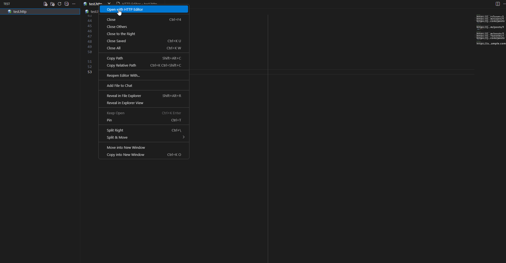

# HTTP Request Editor

A VS Code extension for working with `.http` files featuring a Postman-like interface.

<p align="center">
  
</p>

## Features

- 📋 **Request List** - View all HTTP requests from your `.http` file in an organized sidebar
- ✏️ **Rich Editor** - Edit request method, URL, headers, and body with intuitive controls
- 🎯 **Multiple Body Types** - Support for JSON, URL-encoded, XML, HTML, JavaScript, and plain text
- 🚀 **Send Requests** - Execute HTTP requests and view responses in real-time
- 🔐 **Pre-Request Auth** - Automatic authentication with token extraction from auth responses
- 📊 **Response Viewer** - Inspect response status, headers, and formatted body
- 🔤 **Variables** - Define and use variables throughout your requests
- 📋 **cURL Export** - Export any request to cURL command (Windows/Unix compatible)
- 📥 **Import** - Import Postman collections and cURL commands
- 💾 **Auto-save** - Save your changes back to the `.http` file
- 🎨 **VS Code Themes** - Seamlessly integrates with your editor theme

## Usage

### Opening the Editor

1. Create or open a `.http` file
2. Right-click on the file
3. Select **"Open with HTTP Editor"**

Alternatively, right-click on an open `.http` file tab and select the same option.

### Managing Requests

- **Create**: Click the "**+ New**" button in the sidebar
- **Edit**: Select a request and modify its properties in the main panel
- **Delete**: Hover over a request and click the "**Delete**" button
- **Save**: Click "**💾 Save All**" to persist changes to the file

### Sending Requests

1. Select or create a request
2. Configure method, URL, headers, and body
3. Click **"Send"** button
4. View the response in the Response tab

### Pre-Request Authentication

The extension supports automatic authentication before sending your main requests:

1. **Enable Pre-Auth**: Toggle "Pre-Request Authentication" at the top of the editor
2. **Configure Auth Request**: Paste a cURL command for your authentication endpoint
   - Use `{{username}}` and `{{password}}` placeholders in the cURL command
   - Enter your credentials in the Username and Password fields
3. **Set Response Path**: Specify the JSON path to extract the token (e.g., `token` or `data.access_token`)
4. **Use Auth Token**: The extracted value will be stored in the `@auth` variable and automatically used in your requests

**Example:**

```
### @PRE-AUTH
```

The pre-auth configuration is stored in the `.http` file with the special `### @PRE-AUTH` marker, but credentials are **never** saved to the file - they are only kept in memory during your session for security.

Use the `{{auth}}` variable in your requests' headers:

```http
Authorization: Bearer {{auth}}
```

### Export to cURL

Click the **"📋 cURL"** button to copy the current request as a cURL command to your clipboard.

## .http File Format

```http
@baseUrl = https://api.example.com
@apiKey = your-api-key-here

### Get All Users
GET {{baseUrl}}/users
Accept: application/json
X-API-Key: {{apiKey}}

### Create User
POST {{baseUrl}}/users
Content-Type: application/json

{
  "name": "John Doe",
  "email": "john@example.com"
}

### Update User with Auth
PUT {{baseUrl}}/users/1
Content-Type: application/json
Authorization: Bearer {{auth}}

{
  "name": "Jane Doe"
}
```

**Format Rules:**

- `@variableName = value` - Define variables at the top of the file
- `{{variableName}}` - Use variables in URLs, headers, or body
- `###` - Request separator (followed by optional request name)
- `### @PRE-AUTH` - Special marker for pre-authentication configuration
- First line after separator: `METHOD URL`
- Headers: `Header-Name: Value`
- Empty line before request body
- Body: Any content (JSON, XML, text, etc.)

## Supported Body Types

- **JSON** - Automatically formatted and validated
- **URL Encoded** - Form data format (`key=value&key2=value2`)
- **XML** - XML documents
- **HTML** - HTML content
- **JavaScript** - JavaScript code
- **Text** - Plain text (default)

The body type is automatically detected based on `Content-Type` header or content structure.

## Supported HTTP Methods

- GET
- POST
- PUT
- DELETE
- PATCH
- HEAD
- OPTIONS

## Requirements

- Visual Studio Code 1.80.0 or higher

## Extension Settings

This extension doesn't require any additional configuration. Just install and start using!

## Known Issues

None at this time. Please report issues on [GitHub](https://github.com/alexermolov/http-editor/issues).

## Release Notes

### 1.0.0

Initial release:

- Full HTTP request editor with Postman-like UI
- Support for all major HTTP methods
- Multiple body types (JSON, URL-encoded, XML, etc.)
- Response viewer with status, headers, and body
- cURL export functionality
- Auto-save to `.http` files

## Contributing

Contributions are welcome! Please feel free to submit a Pull Request.

## License

MIT

---

**Enjoy!** 🚀
